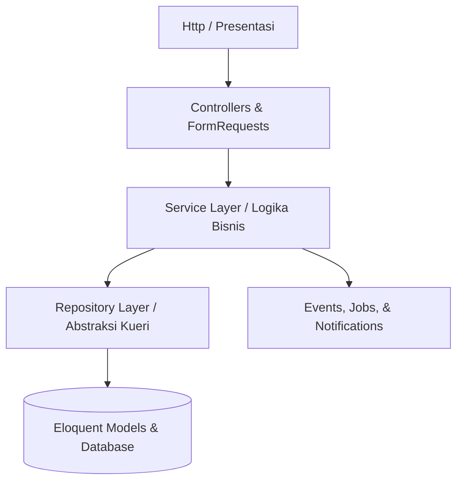
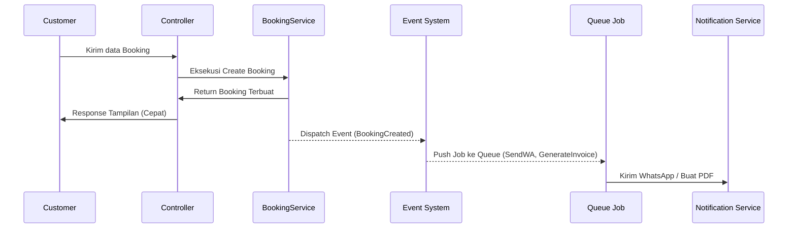

# Blueprint Arsitektur Sistem - CHIVAL V2

Dokumen ini mendefinisikan arsitektur sistem, struktur folder, pola desain, strategi keamanan, dan integrasi runtime untuk pembangunan ulang **CHIVAL V2** menggunakan Laravel 13.

---

## 1. Arsitektur Modular Laravel (Namespace-Based Domains)

Tanpa merusak struktur bawaan Laravel yang ramping, CHIVAL V2 menggunakan pendekatan **Domain-driven Namespace Partitioning**. Modul dipisahkan di dalam folder standar `app/` menggunakan penamaan namespace domain:



### Pembagian Layer Utama:
1.  **Core Layer:** Pengaturan global aplikasi, middleware keamanan dasar, helper umum, dan custom Exception handler.
2.  **Shared Layer:** Trait reusable (seperti audit logger, response formatter), base classes, dan interface kontrak.
3.  **Module Layer:** Pengelompokan logika fungsional sistem ke dalam tiga domain utama: **Business**, **Operational**, dan **Website**.

---

## 2. Struktur Folder Project

Struktur folder terstandarisasi untuk CHIVAL V2 didefinisikan sebagai berikut:

```
app/
├── Http/
│   ├── Controllers/
│   │   ├── Business/           <-- Controller domain Bisnis
│   │   ├── Operational/        <-- Controller domain Operasional
│   │   └── Website/            <-- Controller domain CMS/Website
│   ├── Middleware/
│   └── Requests/
│       ├── Business/           <-- Form Request Validasi Bisnis
│       ├── Operational/        <-- Form Request Validasi Operasional
│       └── Website/            <-- Form Request Validasi Website
├── Services/
│   ├── Business/               <-- Logika bisnis domain Bisnis
│   ├── Operational/            <-- Logika bisnis domain Operasional
│   └── Website/                <-- Logika bisnis domain Website
├── Repositories/
│   ├── Business/               <-- Abstraksi query domain Bisnis
│   ├── Operational/            <-- Abstraksi query domain Operasional
│   └── Website/                <-- Abstraksi query domain Website
├── Models/                     <-- Model Eloquent dengan relasi ketat
├── Policies/                   <-- Laravel Policy untuk otorisasi aksi
├── Events/                     <-- Event domain bisnis
├── Jobs/                       <-- Queueable background jobs
├── Notifications/              <-- WhatsApp & Email notification classes
└── Providers/
    └── AppServiceProvider.php
docs/                           <-- Folder dokumentasi arsitektur & modul
```

---

## 3. Pola Desain Dan Desentralisasi Kode (Code Layering Pattern)

### A. Service Layer
Seluruh logika bisnis bisnis murni diisolasi di dalam kelas Service di bawah namespace `App\Services`. Controller dilarang melakukan perhitungan logika, modifikasi data langsung, atau berinteraksi langsung dengan payment SDK.
*   *Tanggung Jawab:* Penjumlahan harga, verifikasi kuota slot, interaksi dengan API Midtrans.
*   *Sifat:* State-free, reusable, dan sepenuhnya testable melalui Unit Testing.

### B. Repository Layer
Mencegah duplikasi kueri Eloquent (DRY) di berbagai service. Ditempatkan di bawah namespace `App\Repositories`.
*   *Tanggung Jawab:* Menyembunyikan kompleksitas kueri JOIN, filter, query scope, dan pagination.
*   *Metode:* Service memanggil Repository untuk mengambil model, kemudian melakukan manipulasi bisnis.

### C. Request Layer (Form Request Validation)
Validasi tipe data, format input, dan batasan dasar (seperti ketersediaan ID) didelegasikan sepenuhnya ke kelas Form Request di `App\Http\Requests`.
*   *Aturan:* Controller hanya dapat mengambil data yang telah divalidasi via `$request->validated()`.

### D. Policy (Authorization Layer)
Otorisasi aksi berbasis entitas (misal: "Apakah user X boleh mengunduh invoice Y?") diletakkan pada kelas Policy di `App\Policies` dan diregistrasikan ke Model terkait.
*   *Implementasi:* Dipanggil di Controller menggunakan `$this->authorize('view', $invoice)`.

---

## 4. Pola Event, Job, Dan Notification (Event-Driven Architecture)

Aplikasi akan memproses tugas berat secara asinkronus menggunakan sistem antrean (*Queue*) bawaan Laravel untuk menjaga performa response time.



*   **Events (`App\Events`):** Merekam kejadian bisnis penting (misal: `BookingCreated`, `PaymentSettled`, `JobCompleted`).
*   **Jobs (`App\Jobs`):** Tugas background asinkron yang memakan waktu, seperti:
    *   `ReleaseExpiredReservations`: Melepas sesi jadwal yang terkunci jika transaksi gagal dibayar dalam 10 menit.
    *   `GenerateInvoicePdf`: Mengompilasi invoice PDF menggunakan DomPDF.
*   **Notifications (`App\Notifications`):** Manajemen notifikasi multi-channel (WhatsApp API dan Email) untuk mengirimkan kode OTP, tagihan pembayaran, dan ulasan selesai tugas.

---

## 5. Strategi Runtime & Sistem Pendukung

### A. Storage Strategy (Penyimpanan Media)
*   **Upload Sanitization:** Setiap gambar dokumentasi before/after dari karyawan disaring menggunakan rule Laravel (`image|mimes:jpeg,png,webp|max:5120`).
*   **Disk Separation:**
    *   `public` disk: Menyimpan aset statis web (CMS, banner, faq).
    *   `private` disk (terproteksi): Menyimpan foto profil user, gambar verifikasi transfer, dan dokumentasi pengerjaan. File hanya dapat diunduh melalui controller berproteksi auth token (signed URLs).
*   **Naming Convention:** Menggunakan format acak UUID untuk menghindari *directory traversal* (contoh: `jobs/before-pics/uuid-string.webp`).

### B. Cache Strategy (Redis / Database Cache)
*   **Atomic Session Locking:** Menggunakan Redis lock / cache lock saat customer memilih slot booking, guna memastikan tidak terjadi double booking untuk sesi yang sama dari customer berbeda.
*   **Catalog Caching:** Master data harga paket dan add-on yang jarang berubah di-cache secara permanen dan di-invalidate otomatis ketika admin memperbarui katalog.
*   **Rate-Limit Caching:** Membatasi akses request login, OTP, dan inisiasi pembayaran berdasarkan IP address dan User ID.

### C. Route & Middleware Strategy
*   **Route Grouping:** Pemisahan file rute menjadi rute publik, rute dashboard customer (`auth:sanctum`), rute operasional karyawan, dan rute panel admin/owner dengan kontrol middleware ketat.
*   **Security Middlewares:** Penerapan header keamanan (X-Content-Type-Options, X-Frame-Options, Content-Security-Policy) serta penanganan CSRF token yang ketat di setiap rute mutasi state (POST/PUT/DELETE).

---

## 6. Alur Autentikasi Dan Otorisasi

### A. Alur Autentikasi (Authentication Flow)
1.  Menggunakan Laravel Breeze/Session Auth berbasis cookie terenkripsi yang aman untuk platform web responsif.
2.  Session berproteksi `HttpOnly`, `Secure` (saat HTTPS aktif), dan `SameSite=Lax`.
3.  Token CSRF disisipkan pada setiap pemanggilan AJAX/Form submission.
4.  Fitur *Rate Limiting* aktif untuk endpoint login (`ThrottleRequests` middleware, maks 5 percobaan per menit).

### B. Alur Otorisasi (Authorization Flow)
1.  Sistem menggunakan pendekatan Role-Permission. Role didefinisikan ke dalam tabel database: `owner`, `admin`, `employee`, dan `customer`.
2.  Setiap aksi CRUD kritis dilindungi oleh middleware role (`middleware('role:admin')`) dan detail objek diotorisasi menggunakan kelas **Laravel Policy**.

---

## 7. Penanganan Error, Logging, Dan Pemantauan

### A. Error Handling (Global Exception Handler)
*   Dikonfigurasi terpusat pada file [bootstrap/app.php](file:///c:/laragon/www/chival-v2/bootstrap/app.php).
*   Memisahkan penanganan error API JSON (`shouldRenderJsonWhen`) dan halaman web HTML reguler.
*   Menghindari paparan error SQL mentah ke pengguna akhir dengan membungkus `QueryException` ke dalam pesan generik ramah pengguna.

### B. Audit Trail & Logging (Logging Strategy)
*   **Payment Log Stack:** Saluran log khusus untuk Midtrans (`storage/logs/payment.log`) guna melacak request payload, status settlement, dan validasi signature key.
*   **Audit Logger Trait:** Trait yang disematkan pada model Eloquent untuk merekam otomatis setiap log aktivitas admin (siapa yang mengubah harga layanan, siapa yang mengubah status booking, dan data lama vs data baru).
