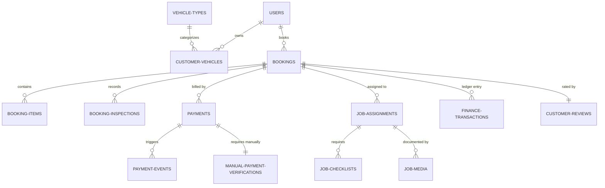

# Blueprint Database Terintegrasi - CHIVAL V2

Dokumen ini menjelaskan rancangan skema database relasional yang telah dinormalisasi untuk **CHIVAL V2**. Skema ini meninggalkan model *JSON blob state* lama (`operational_state`) dan menerapkan integritas referensial yang kuat (Foreign Key), indeks performa, soft deletes, serta kolom audit jejak langkah.

---

## 1. Entity Relationship Diagram (ERD)

Berikut adalah struktur hubungan antar entitas bisnis utama pada CHIVAL V2:

---

## 2. Definisi Struktur Tabel Database

### A. Core / Identity Tables

#### `users`
Menyimpan profil akun pengguna (Customer, Admin, Owner, Employee).
*   **Columns:**
    *   `id` (BIGINT, PK, Auto Increment)
    *   `name` (VARCHAR 160)
    *   `email` (VARCHAR 190, Unique, Nullable)
    *   `phone` (VARCHAR 40, Unique)
    *   `password` (VARCHAR 255)
    *   `role` (ENUM: 'owner', 'admin', 'employee', 'customer')
    *   `status` (ENUM: 'active', 'inactive', Default: 'active')
    *   `created_at`, `updated_at` (Timestamp)
    *   `deleted_at` (Timestamp, Soft Delete)
*   **Indexes:**
    *   `users_role_status_index` (`role`, `status`)

#### `customer_vehicles`
Profil kendaraan milik customer yang digunakan untuk booking.
*   **Columns:**
    *   `id` (BIGINT, PK, Auto Increment)
    *   `customer_id` (BIGINT, FK -> `users.id`, Restrict)
    *   `vehicle_type_id` (BIGINT, FK -> `vehicle_types.id`, Restrict)
    *   `brand_model` (VARCHAR 160)
    *   `plate_number` (VARCHAR 40)
    *   `color` (VARCHAR 80, Nullable)
    *   `notes` (TEXT, Nullable)
    *   `is_default` (TINYINT 1, Default: 0)
    *   `created_at`, `updated_at` (Timestamp)
*   **Indexes:**
    *   `vehicles_customer_id_index` (`customer_id`)

#### `vehicle_types`
Kategori ukuran kendaraan untuk menentukan harga layanan (S/M/L/XL).
*   **Columns:**
    *   `id` (BIGINT, PK, Auto Increment)
    *   `name` (VARCHAR 80)
    *   `size` (ENUM: 'small', 'medium', 'large', 'xlarge')
    *   `is_active` (TINYINT 1, Default: 1)
    *   `created_at`, `updated_at` (Timestamp)

---

### B. Catalog Tables

#### `services`
Daftar paket detailing utama.
*   **Columns:**
    *   `id` (BIGINT, PK, Auto Increment)
    *   `code` (VARCHAR 80, Unique)
    *   `name` (VARCHAR 160)
    *   `description` (TEXT, Nullable)
    *   `is_active` (TINYINT 1, Default: 1)
    *   `created_at`, `updated_at` (Timestamp)

#### `service_price_tiers`
Matriks harga paket detailing berdasarkan ukuran tipe kendaraan.
*   **Columns:**
    *   `id` (BIGINT, PK, Auto Increment)
    *   `service_id` (BIGINT, FK -> `services.id`, Cascade)
    *   `vehicle_size` (ENUM: 'small', 'medium', 'large', 'xlarge')
    *   `price` (INT UNSIGNED)
    *   `created_at`, `updated_at` (Timestamp)
*   **Uniques:**
    *   `service_tier_unique` (`service_id`, `vehicle_size`)

#### `addons`
Layanan tambahan (extra conditions) yang ditawarkan.
*   **Columns:**
    *   `id` (BIGINT, PK, Auto Increment)
    *   `code` (VARCHAR 80, Unique)
    *   `name` (VARCHAR 160)
    *   `description` (TEXT, Nullable)
    *   `price` (INT UNSIGNED)
    *   `trigger_keywords` (TEXT, Nullable) <-- Untuk auto-rekomendasi
    *   `is_active` (TINYINT 1, Default: 1)
    *   `created_at`, `updated_at` (Timestamp)

#### `coverage_areas`
Area jangkauan detailing beserta biaya transportasinya.
*   **Columns:**
    *   `id` (BIGINT, PK, Auto Increment)
    *   `name` (VARCHAR 120)
    *   `fee` (INT UNSIGNED, Default: 0)
    *   `note` (VARCHAR 255, Nullable)
    *   `requires_admin_approval` (TINYINT 1, Default: 0)
    *   `is_active` (TINYINT 1, Default: 1)
    *   `created_at`, `updated_at` (Timestamp)

---

### C. Booking & Transaction Tables

#### `bookings`
Tabel utama penyimpan order booking detailing dari customer.
*   **Columns:**
    *   `id` (BIGINT, PK, Auto Increment)
    *   `customer_id` (BIGINT, FK -> `users.id`, Restrict)
    *   `vehicle_id` (BIGINT, FK -> `customer_vehicles.id`, Restrict)
    *   `coverage_area_id` (BIGINT, FK -> `coverage_areas.id`, Restrict)
    *   `promotion_id` (BIGINT, FK -> `promotions.id`, Nullable, Set Null)
    *   `code` (VARCHAR 40, Unique) <-- Kode Booking (misal: CHV-YYYYMMDD-XXXX)
    *   `address` (TEXT) <-- Alamat lokasi pengerjaan home service
    *   `booking_date` (DATE)
    *   `booking_time_slot` (VARCHAR 40)
    *   `total_service_price` (INT UNSIGNED)
    *   `total_addon_price` (INT UNSIGNED, Default: 0)
    *   `area_fee` (INT UNSIGNED, Default: 0)
    *   `discount_amount` (INT UNSIGNED, Default: 0)
    *   `total_amount` (INT UNSIGNED)
    *   `required_dp_amount` (INT UNSIGNED)
    *   `amount_paid` (INT UNSIGNED, Default: 0)
    *   `payment_status` (ENUM: 'unpaid', 'partial_dp', 'paid', 'refunded', Default: 'unpaid')
    *   `status` (ENUM: 'pending', 'confirmed', 'assigned', 'in_progress', 'completed', 'cancelled', Default: 'pending')
    *   `notes` (TEXT, Nullable)
    *   `completed_at` (Timestamp, Nullable)
    *   `created_at`, `updated_at` (Timestamp)
    *   `deleted_at` (Timestamp, Soft Delete)
*   **Indexes:**
    *   `bookings_date_slot_index` (`booking_date`, `booking_time_slot`)
    *   `bookings_status_index` (`status`, `payment_status`)

#### `booking_items`
Arsip snapshot item (layanan & addon) yang dipesan. Berfungsi menjaga integritas data harga masa lalu jika katalog berubah.
*   **Columns:**
    *   `id` (BIGINT, PK, Auto Increment)
    *   `booking_id` (BIGINT, FK -> `bookings.id`, Cascade)
    *   `item_type` (ENUM: 'service', 'addon')
    *   `item_id` (BIGINT)
    *   `name_snapshot` (VARCHAR 180)
    *   `price_snapshot` (INT UNSIGNED)
    *   `created_at`, `updated_at` (Timestamp)

#### `booking_inspections`
Menyimpan rekam jawaban keluhan/inspeksi kondisi mobil customer.
*   **Columns:**
    *   `id` (BIGINT, PK, Auto Increment)
    *   `booking_id` (BIGINT, FK -> `bookings.id`, Cascade)
    *   `question_snapshot` (VARCHAR 255)
    *   `answer` (TEXT)
    *   `created_at` (Timestamp)

---

### D. Payment Tables

#### `payments`
Setiap inisiasi transaksi Midtrans atau manual WA akan melahirkan baris di tabel ini.
*   **Columns:**
    *   `id` (BIGINT, PK, Auto Increment)
    *   `booking_id` (BIGINT, FK -> `bookings.id`, Cascade)
    *   `payment_code` (VARCHAR 80, Unique) <-- Order ID eksternal Midtrans
    *   `payment_type` (ENUM: 'dp', 'full_settlement')
    *   `provider` (ENUM: 'midtrans', 'manual_whatsapp')
    *   `gross_amount` (INT UNSIGNED)
    *   `payment_url` (TEXT, Nullable)
    *   `snap_token` (VARCHAR 255, Nullable)
    *   `provider_transaction_id` (VARCHAR 120, Nullable)
    *   `transaction_status` (VARCHAR 80, Nullable)
    *   `payment_status` (ENUM: 'pending', 'success', 'expired', 'failed', 'refunded', Default: 'pending')
    *   `paid_at` (Timestamp, Nullable)
    *   `expired_at` (Timestamp, Nullable)
    *   `created_at`, `updated_at` (Timestamp)
*   **Indexes:**
    *   `payments_booking_status_index` (`booking_id`, `payment_status`)

#### `payment_events`
Log webhook/notification payload dari Midtrans (anti-replay & idempotency audit).
*   **Columns:**
    *   `id` (BIGINT, PK, Auto Increment)
    *   `payment_id` (BIGINT, FK -> `payments.id`, Cascade)
    *   `event_type` (VARCHAR 80)
    *   `payload_hash` (CHAR 64, Unique)
    *   `payload_json` (JSON)
    *   `processed_at` (Timestamp)
    *   `created_at` (Timestamp)

#### `manual_payment_verifications`
Untuk bukti pembayaran transfer bank manual/WhatsApp yang divalidasi admin.
*   **Columns:**
    *   `id` (BIGINT, PK, Auto Increment)
    *   `payment_id` (BIGINT, FK -> `payments.id`, Cascade)
    *   `verifier_id` (BIGINT, FK -> `users.id`, Nullable, Restrict) <-- Admin audit column
    *   `proof_file_path` (VARCHAR 255)
    *   `note` (TEXT, Nullable)
    *   `verified_at` (Timestamp, Nullable)
    *   `created_at`, `updated_at` (Timestamp)

---

### E. Operational Tables

#### `job_assignments`
Disposisi tugas detailing kepada karyawan.
*   **Columns:**
    *   `id` (BIGINT, PK, Auto Increment)
    *   `booking_id` (BIGINT, FK -> `bookings.id`, Restrict)
    *   `employee_id` (BIGINT, FK -> `users.id`, Restrict)
    *   `status` (ENUM: 'pending', 'started', 'completed', Default: 'pending')
    *   `assigned_at` (Timestamp)
    *   `started_at` (Timestamp, Nullable)
    *   `completed_at` (Timestamp, Nullable)
    *   `created_at`, `updated_at` (Timestamp)

#### `job_checklists`
SOP checklist pengerjaan di lapangan yang diisi karyawan.
*   **Columns:**
    *   `id` (BIGINT, PK, Auto Increment)
    *   `job_assignment_id` (BIGINT, FK -> `job_assignments.id`, Cascade)
    *   `description` (VARCHAR 255)
    *   `is_checked` (TINYINT 1, Default: 0)
    *   `checked_at` (Timestamp, Nullable)

#### `job_media`
Penyimpanan file foto before/after pengerjaan (menyimpan berkas fisik path).
*   **Columns:**
    *   `id` (BIGINT, PK, Auto Increment)
    *   `job_assignment_id` (BIGINT, FK -> `job_assignments.id`, Cascade)
    *   `uploader_id` (BIGINT, FK -> `users.id`, Restrict)
    *   `file_path` (VARCHAR 255)
    *   `stage` (ENUM: 'before', 'after')
    *   `file_mime` (VARCHAR 80)
    *   `file_size` (INT UNSIGNED)
    *   `created_at` (Timestamp)

---

### F. Finance Tables

#### `finance_transactions`
Buku kas Ledger utama yang menampung semua pemasukan per job maupun pengeluaran operasional.
*   **Columns:**
    *   `id` (BIGINT, PK, Auto Increment)
    *   `booking_id` (BIGINT, FK -> `bookings.id`, Nullable, Set Null)
    *   `transaction_type` (ENUM: 'income', 'expense')
    *   `category` (VARCHAR 80) <-- Gaji, Chemical, Alat, Operasional, Transport
    *   `description` (VARCHAR 255)
    *   `amount` (INT UNSIGNED)
    *   `transaction_date` (DATE)
    *   `payment_method` (ENUM: 'cash', 'transfer', 'qris')
    *   `ledger_allocations` (JSON, Nullable) <-- Untuk pembagian laba ke pos dana
    *   `created_by` (BIGINT, FK -> `users.id`, Nullable, Restrict) <-- Admin audit column
    *   `created_at`, `updated_at` (Timestamp)
*   **Indexes:**
    *   `finance_date_type_index` (`transaction_date`, `transaction_type`)

---

### G. Engagement & Content Tables

#### `customer_reviews`
Ulasan customer terhadap kualitas pekerjaan.
*   **Columns:**
    *   `id` (BIGINT, PK, Auto Increment)
    *   `booking_id` (BIGINT, FK -> `bookings.id`, Cascade)
    *   `rating` (TINYINT UNSIGNED) <-- Skala 1-5
    *   `comment` (TEXT)
    *   `is_visible` (TINYINT 1, Default: 1)
    *   `approved_by` (BIGINT, FK -> `users.id`, Nullable, Restrict) <-- Admin moderator
    *   `approved_at` (Timestamp, Nullable)
    *   `created_at`, `updated_at` (Timestamp)
*   **Uniques:**
    *   `review_booking_unique` (`booking_id`)
