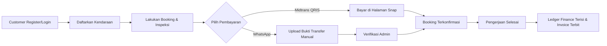
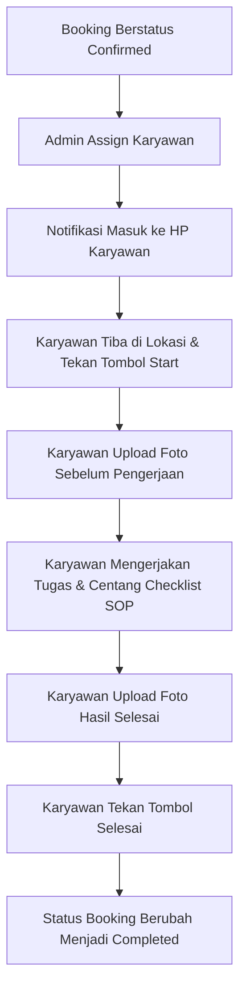

# Blueprint Modul Sistem - CHIVAL V2

Dokumen ini mendefinisikan pembagian fungsional aplikasi **CHIVAL V2** ke dalam tiga modul utama: **BUSINESS**, **OPERATIONAL**, dan **WEBSITE**. Setiap modul berfokus pada fungsionalitas tertentu dengan alur kerja, tabel database, serta hak akses yang terdefinisi dengan jelas.

---

## 1. Modul Business

### A. Tujuan Modul
Mengelola inti bisnis komersial Chival Detailing, meliputi pendaftaran pelanggan, pemesanan jasa detailing, pemrosesan pembayaran otomatis, pembuatan faktur (invoice), pembagian keuangan (profit ledger), dan hubungan pelanggan (CRM).

### B. Fitur
*   **Customer & Vehicle Profile:** Portal pelanggan untuk mengelola data identitas dan armada kendaraan pribadi.
*   **Multi-Step Booking Wizard:** Halaman booking interaktif yang mendeteksi jenis kendaraan, keluhan, rekomendasi addon secara *real-time*, biaya wilayah, dan diskon promo.
*   **Automated Payment Integration:** Integrasi Midtrans Snap QRIS untuk DP/Lunas dan penanganan webhook status transaksi secara otomatis.
*   **Invoice Engine:** Pembuatan berkas invoice otomatis dalam format PDF.
*   **Finance & Profit Ledger:** Buku kas yang secara otomatis menghitung laba bersih, komisi, biaya modal, dan membagi profit ke pos dana tersimpan (kas owner, marketing, operasional, darurat) setelah job diselesaikan.

### C. Database yang Digunakan
*   `users` (role: customer)
*   `customer_vehicles`
*   `vehicle_types`
*   `bookings`
*   `booking_items`
*   `booking_inspections`
*   `payments`
*   `payment_events`
*   `manual_payment_verifications`
*   `finance_transactions`
*   `customer_reviews`

### D. Dependency (Ketergantungan Modul)
*   Membutuhkan **Modul Operational** untuk memeriksa ketersediaan slot jadwal (`bookings.booking_date` & `bookings.booking_time_slot`).

### E. Permissions (Hak Akses)
*   `customer` (Membuat booking, melihat invoice pribadi, membayar Midtrans).
*   `admin` / `owner` (Membaca semua transaksi, verifikasi manual, melihat pembukuan kas/finance).

### F. Alur Kerja (Workflow)

---

## 2. Modul Operational

### A. Tujuan Modul
Mengatur jalannya operasional detailing di lapangan secara efisien. Menjamin tidak terjadi bentrok jadwal, mengelola pembagian tugas karyawan, memantau kualitas kerja melalui checklist SOP, dan menyediakan media dokumentasi hasil kerja.

### B. Fitur
*   **Dynamic Schedule & Slot Capacity:** Admin dapat mengatur batas kapasitas sesi pengerjaan per hari, menutup tanggal tertentu, atau memberi jeda darurat.
*   **Job Assignment Manager:** Konsol admin untuk mendistribusikan order confirmed kepada karyawan detailing yang luang.
*   **Employee SOP Checklist:** Karyawan wajib mencentang setiap item SOP detailing (eksterior wash, vacuum jok, tar dressing) sebelum menyelesaikan tugas.
*   **Before/After Documentation Upload:** Karyawan wajib mengunggah foto kondisi kendaraan sebelum dan sesudah dikerjakan langsung dari smartphone di lokasi customer.
*   **Daily Activity Monitoring:** Dasbor bagi owner untuk melihat progres pengerjaan harian (pending, started, completed) secara real-time.

### C. Database yang Digunakan
*   `users` (role: employee, admin)
*   `job_assignments`
*   `job_checklists`
*   `job_media`

### D. Dependency (Ketergantungan Modul)
*   Sangat bergantung pada data order dari **Modul Business** (`bookings` & `booking_items`) untuk dasar penugasan kerja.

### E. Permissions (Hak Akses)
*   `employee` (Mengubah status tugas, mencentang checklist, mengunggah foto pengerjaan).
*   `admin` / `owner` (Melakukan assign karyawan, memantau status operasional, mengelola kuota jadwal harian).

### F. Alur Kerja (Workflow)

---

## 3. Modul Website

### A. Tujuan Modul
Bertindak sebagai garda terdepan pemasaran bisnis Chival Detailing di internet (Landing Page). Mengelola konten informasi, portofolio pekerjaan, testimoni pelanggan, dan optimasi mesin pencari (SEO) secara mandiri melalui Content Management System (CMS).

### B. Fitur
*   **Visual Banner Manager:** Mengelola gambar slider/promo di halaman depan.
*   **Dynamic Landing Page CMS:** Admin dapat mengubah copy teks benefit, kontak, alamat maps, dan paket unggulan secara instan tanpa menyentuh kode program.
*   **Visual Gallery Portofolio:** Menampilkan foto before/after pilihan admin untuk meyakinkan calon pelanggan.
*   **FAQ Manager:** Pengelolaan daftar pertanyaan umum pelanggan yang interaktif.
*   **SEO Optimizer:** Input meta title, meta description, alt text image, dan generator sitemap.xml.
*   **Customer Reviews Moderation:** Mengambil ulasan asli dari tabel database untuk ditampilkan di landing page setelah disetujui (dimoderasi) oleh admin.

### C. Database yang Digunakan
*   `customer_reviews` (Untuk ulasan yang ditampilkan di landing page)
*   `settings` (Tabel konfigurasi key-value Laravel standar untuk menyimpan data copy CMS)

### D. Dependency (Ketergantungan Modul)
*   Mengambil review berstatus disetujui (`customer_reviews.is_visible = 1`) dari **Modul Business** untuk ditampilkan sebagai ulasan sosial di landing page.

### E. Permissions (Hak Akses)
*   `guest` / `customer` (Membaca konten landing page, FAQ, portfolio gallery).
*   `admin` / `owner` (Mengedit banner, FAQ, detail CMS, moderasi ulasan customer).

### F. Alur Kerja (Workflow)
1.  **Guest** mengunjungi website Chival Detailing, membaca FAQ, dan melihat galeri before/after.
2.  **Customer** yang telah menyelesaikan pengerjaan menulis ulasan dan memberikan rating di dashboard mereka (Modul Business).
3.  Ulasan masuk ke antrean moderasi **Admin** di panel belakang Modul Website.
4.  **Admin** menyetujui ulasan (`is_visible = 1`), ulasan otomatis dirender di bagian testimonial Landing Page.
5.  **Admin** memperbarui harga promo banner di CMS, tampilan landing page langsung terupdate secara real-time.
