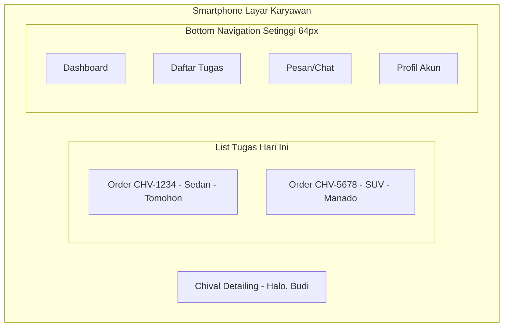
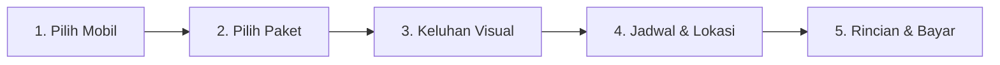

# Design System & UI/UX Blueprint - CHIVAL V2

Dokumen ini mendefinisikan standar antarmuka pengguna (UI) dan pengalaman pengguna (UX) untuk **CHIVAL V2**. Mengadopsi prinsip **Mobile-First**, menggunakan **Tailwind CSS v4**, serta berfokus pada desain minimalis profesional dengan tata letak yang bersih.

---

## 1. Identitas Visual & Token Desain

### A. Palet Warna (Color Palette)
Menggunakan paduan warna bertema otomotif premium gelap dengan aksen kuning *warning/sporty* yang tajam.

| Nama Warna | Token Tailwind | Kode Hex | Peran Visual |
|---|---|---|---|
| **Primary Yellow** | `bg-amber-400` | `#fbbf24` | Tombol utama, aksen aktif, status penting. |
| **Dark Charcoal** | `bg-zinc-900` | `#18181b` | Latar belakang utama aplikasi (Dark Mode). |
| **Coal Gray** | `bg-zinc-800` | `#27272a` | Latar belakang elemen input, panel sidebar, card. |
| **Border Gray** | `border-zinc-700`| `#3f3f46` | Pembatas antar komponen. |
| **Muted Gray** | `text-zinc-400` | `#a1a1aa` | Teks penjelasan, deskripsi sekunder, placeholder. |
| **White Text** | `text-zinc-100` | `#f4f4f5` | Teks utama aplikasi. |

### B. Tipografi (Typography)
*   **Font Keluarga:** Menggunakan font Google Fonts **'Instrument Sans'** atau **'Inter'** sans-serif.
*   **Skala Teks:**
    *   Judul Utama: `text-2xl font-bold tracking-tight`
    *   Sub Judul: `text-lg font-semibold`
    *   Teks Utama (Body): `text-sm font-normal text-zinc-100`
    *   Teks Sekunder (Muted): `text-xs font-normal text-zinc-400`

---

## 2. Struktur Tata Letak (Layout System)

### A. Mobile Layout (Mobile First)
*   **Ketinggian Viewport:** Seluruh halaman mobile diatur pas dengan tinggi viewport (`h-screen overflow-hidden`).
*   **Area Navigasi:** Menggunakan **Bottom Navigation Bar** setinggi 64px di bagian bawah untuk akses jempol yang cepat.
*   **Konten Tengah:** Menggunakan scrollable container (`overflow-y-auto pb-24`) agar konten tidak tertutup bar navigasi.

### B. Tablet & Desktop Layout
*   **Sidebar:** Pada layar `md:` ke atas, Bottom Nav disembunyikan (`hidden md:flex`). Sidebar setinggi `h-screen` dan lebar `w-64` muncul di sebelah kiri.
*   **Grid Sistem:** Dashboard dan katalog menggunakan struktur grid (`grid grid-cols-1 md:grid-cols-2 lg:grid-cols-3 gap-6`).

---

## 3. Spesifikasi Komponen UI (Tailwind CSS v4 Classes)

### A. Buttons (Tombol)
*   **Primary Button:** Tombol aksi utama (seperti "Konfirmasi Booking", "Bayar").
    `w-full py-3 px-4 rounded-xl bg-amber-400 text-zinc-950 text-sm font-semibold hover:bg-amber-300 transition-colors focus:ring-2 focus:ring-amber-500`
*   **Secondary Button:** Tombol pembatalan/aksi opsional.
    `w-full py-3 px-4 rounded-xl bg-zinc-800 text-zinc-100 text-sm border border-zinc-700 hover:bg-zinc-700 transition-colors`

### B. Form Inputs
*   **Text Input / Select Box:**
    `w-full py-3 px-4 rounded-xl bg-zinc-800 border border-zinc-700 text-zinc-100 placeholder-zinc-500 text-sm focus:border-amber-400 focus:ring-1 focus:ring-amber-400 outline-none transition-all`
*   **Validation Error State:** Ketika isian input tidak valid.
    `border-red-500 focus:border-red-500 focus:ring-red-500`

### C. Tables (Dasbor Desktop)
*   `w-full text-left border-collapse`
*   Header: `bg-zinc-800/50 text-zinc-400 text-xs uppercase tracking-wider py-3 px-4`
*   Baris data: `border-b border-zinc-800 text-sm py-4 px-4 text-zinc-200 hover:bg-zinc-800/30`

### D. Cards (Minimalis)
Mengurangi penggunaan card bertumpuk. Card hanya digunakan untuk membungkus grup informasi yang benar-benar berbeda.
`rounded-2xl bg-zinc-800/50 border border-zinc-700/50 p-5`

---

## 4. Tampilan Interaktif & State UX

*   **Loading State:** Ketika mengambil data, tombol utama diubah menjadi disable dengan ikon spinner SVG berputar: `animate-spin h-5 w-5 mr-3`.
*   **Toast Notification:** Notifikasi sukses/error melayang di pojok atas tengah (mobile) atau kanan atas (desktop).
    `fixed top-4 right-4 z-50 rounded-xl bg-zinc-900 border border-zinc-700 p-4 shadow-2xl flex items-center gap-3 animate-fade-in`
*   **Empty State:** Digunakan pada daftar order/kendaraan jika kosong. Menampilkan ilustrasi monokromatik abu-abu murni dengan CTA tombol tambah data di bawahnya.

---

## 5. Sketsa Wireframe Komponen (Mermaid Layout)

### A. Wireframe Dasbor Karyawan Detailing (Mobile View)
Menunjukkan integrasi antarmuka Mobile-First dengan Bottom Navigation.

### B. Wireframe Alur Booking Wizard (Customer Mobile)
Menunjukkan alur multi-langkah minimalis yang membagi beban pengisian formulir.

*Catatan: Setiap langkah hanya memiliki 1 tombol CTA primer di bagian bawah layar untuk mempertahankan fokus customer.*
