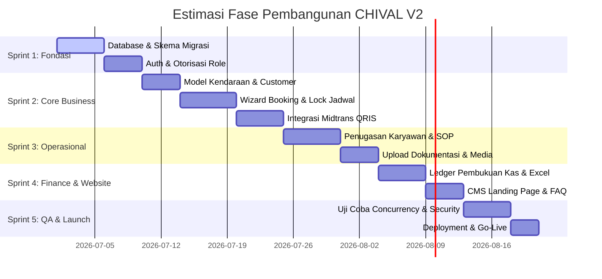

# Peta Jalan Pembangunan (Development Roadmap) - CHIVAL V2

Dokumen ini mendefinisikan fase pengerjaan proyek **CHIVAL V2** yang dibagi ke dalam **5 Sprint logis**. Setiap sprint berfokus pada penyelesaian modul dengan prioritas ketergantungan yang benar (fondasi diselesaikan terlebih dahulu sebelum antarmuka).

---

## 1. Peta Jalan Jalur Sprint (Sprint Timeline)

---

## 2. Rincian Pekerjaan Per Sprint

### 🛠️ Sprint 1: Fondasi Sistem & Keamanan (Foundation & Auth)
Fokus membangun pondasi database, keamanan pengguna, dan otorisasi hak akses.
*   **Item Pekerjaan:**
    *   Pembuatan seluruh migration skema database baru yang ternormalisasi (sesuai `02-Database-Blueprint.md`).
    *   Implementasi Auth System (Register, Login, Session Management, CSRF).
    *   Pembuatan Middleware Role & Permission (owner, admin, employee, customer).
    *   Pengaturan global exceptions handler & logging system di `bootstrap/app.php`.
*   **Kriteria Validasi Selesai (Definition of Done):**
    *   Unit test untuk otorisasi endpoint berhasil dilewati.
    *   Tidak ada SQL Exception mentah yang terekspos ketika request gagal.

### 💳 Sprint 2: Modul Bisnis Utama (Core Business Module)
Fokus pada alur transaksi customer, dari pendaftaran mobil, booking, hingga proses pembayaran.
*   **Item Pekerjaan:**
    *   CRUD Manajemen Kendaraan Customer (`customer_vehicles` & `vehicle_types`).
    *   Pembuatan Booking Engine di backend (`BookingService` & `booking_items` snapshot).
    *   Integrasi SDK Midtrans Snap QRIS & Webhook Handler terproteksi signature.
    *   Pembuatan PDF Invoice Generator.
*   **Kriteria Validasi Selesai (Definition of Done):**
    *   Kalkulasi total harga & DP diuji secara ketat di sisi server (tidak mempercayai input payload browser).
    *   Webhook pembayaran lulus uji idempotensi (tidak memproses duplikat event).

### 🚀 Sprint 3: Modul Operasional Lapangan (Operational Module)
Fokus pada penyediaan sistem kerja karyawan di lapangan dan kontrol penjadwalan.
*   **Item Pekerjaan:**
    *   Dashboard operasional pemantauan tugas harian admin.
    *   Fitur penugasan karyawan (`job_assignments`) & SOP checklist.
    *   Sistem upload foto media before/after dengan validasi MIME & penyimpanan private storage.
    *   Dynamic Sesi Schedule & Slot Locking (pencegahan double booking sesi).
*   **Kriteria Validasi Selesai (Definition of Done):**
    *   Uji coba concurrency (2 request simultan mengambil slot waktu yang sama) berhasil menolak salah satu transaksi.
    *   File gambar non-image ditolak secara otomatis oleh validator upload.

### 📊 Sprint 4: Pembukuan & CMS (Finance Ledger & CMS Website)
Fokus pada otomatisasi pembagian kas pasca pengerjaan selesai dan pembangunan Landing Page.
*   **Item Pekerjaan:**
    *   Pencatatan kas masuk/keluar otomatis di ledger `finance_transactions`.
    *   Pemasangan export excel laporan keuangan terfilter tanggal & wilayah.
    *   Pembangunan Landing Page dinamis berbasis Tailwind CSS v4.
    *   CMS untuk pengelolaan copy teks banner, FAQ, dan galeri before/after.
    *   Moderasi review customer sebelum ditayangkan di landing page.
*   **Kriteria Validasi Selesai (Definition of Done):**
    *   Matematika ledger finance lulus pengujian kalkulasi persentase alokasi profit.
    *   Konten landing page termutasi sukses dari panel CMS.

### 🧪 Sprint 5: Pemolesan & Peluncuran (Optimization & Launch)
Fokus pada performa, pembersihan file development, dan proses deployment.
*   **Item Pekerjaan:**
    *   Pemasangan Cache menggunakan Redis/Database driver untuk slot booking.
    *   Pembersihan berkas development dari build artifact (menghapus router uji, backup SQL lokal).
    *   Audit keamanan XSS & CSRF pada semua formulir input.
    *   Konfigurasi production web server (Nginx/Apache document root ke `/public`).
*   **Kriteria Validasi Selesai (Definition of Done):**
    *   Aplikasi berhasil dideploy ke staging server dan dapat bertransaksi QRIS Midtrans Sandbox secara end-to-end.
